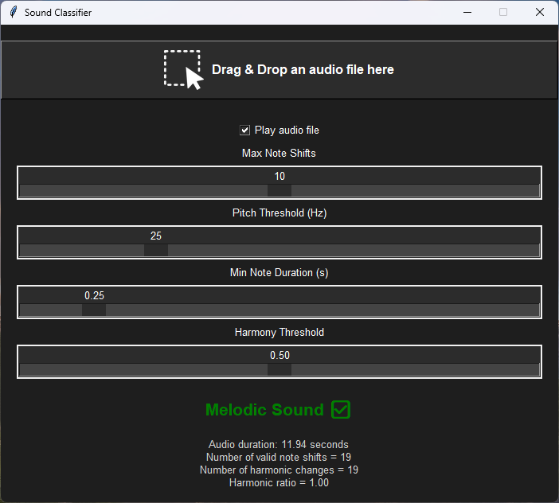

# Sound Classifier

## Overview

The Sound Classifier application is a tool for analyzing audio files to determine if they have a melodic quality. Using the `tkinter` library for the GUI and `librosa` for audio processing, this script provides a user-friendly interface for drag-and-drop audio analysis. Users can adjust various parameters through sliders to influence the analysis results.



## Features

- **Drag & Drop**: Easily load audio files by dragging them into the application window.
- **Audio Playback**: Optionally play the audio file after analysis.
- **Adjustable Parameters**: Configure analysis sensitivity and thresholds using sliders.
- **Results Display**: See if the audio is classified as melodic or non-melodic with visual feedback.

## Installation

1. **Clone the repository:**
    ```bash
    git clone https://github.com/yourusername/sound-classifier.git
    cd sound-classifier
    ```

2. **Install dependencies:**
    Ensure you have `Python 3.x` installed. Then, install the required packages using pip:
    ```bash
    pip install tkinterdnd2 librosa numpy pillow
    ```
    Note: `tkinter` is usually included with Python installations. If not, you may need to install it separately.

## Usage

1. **Run the Script:**
    Execute the script using Python:
    ```bash
    python sound_classifier.py
    ```

2. **Drag & Drop an Audio File:**
    Drag an audio file into the designated area in the application window.

3. **Configure Parameters:**
    - **Max Note Shifts**: Set the maximum number of note shifts considered for a melodic classification.
    - **Pitch Threshold (Hz)**: Adjust the minimum pitch magnitude required for a note to be considered.
    - **Min Note Duration (s)**: Set the minimum duration a note must be sustained to be counted.
    - **Harmony Threshold**: Define the ratio of harmonic changes to note changes required for a melodic classification.

4. **View Results:**
    The result will be displayed as "Melodic Sound ✅" or "Non-melodic Sound ❌", with additional debug information shown below.

## Debug Information Explained

When analyzing an audio file, the debug information provides detailed insights into the analysis process:

- **Number of Valid Note Shifts**: The count of times the pitch changes significantly in the audio. This indicates the variation in pitch, which contributes to the melodic nature of the sound.
- **Number of Harmonic Changes**: The count of note changes that align with common harmonic intervals (e.g., perfect fourths, fifths). A higher count suggests a more harmonious sound.
- **Harmonic Ratio**: The ratio of harmonic changes to total note changes. This value helps determine if the pitch changes are musically harmonious. A higher ratio indicates a greater proportion of harmonic changes, which is typical of melodic sounds.

## Troubleshooting

- **No Sound Playback**: Ensure your system's default audio player is properly configured. Check the console for error messages.
- **Performance Issues**: Large audio files may take longer to process. Ensure your system meets the recommended specifications.

## Warning
The project is intended for general use and educational purposes. The values and metrics provided are subjective and not meant for professional use.
This is one of my first mini-projects using python to learn the syntax and build the audio tool, lots of help was provided from third parties like chatgpt, reddit and the like 
so If you came across few bugs here and there, or if the code didnt function as expected, womp womp


